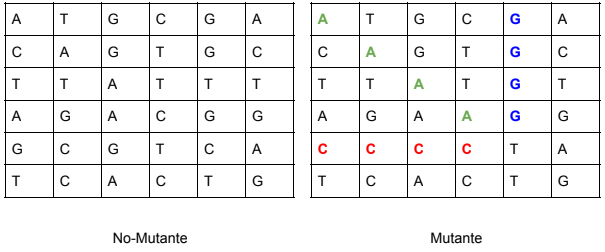
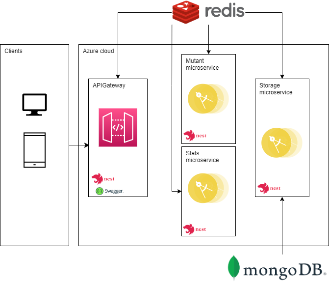
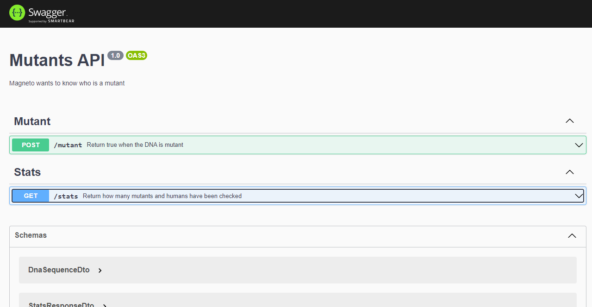
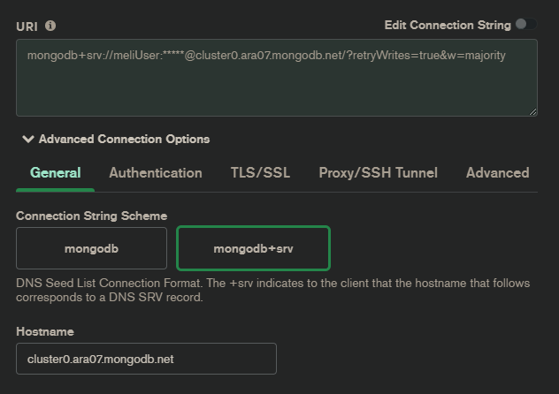

# Problema

Magneto quiere reclutar la mayor cantidad de mutantes para poder luchar
contra los X-Mens.
Te ha contratado a ti para que desarrolles un proyecto que detecte si un
humano es mutante basándose en su secuencia de ADN.
Para eso te ha pedido crear un programa con un método o función con la siguiente firma:

```
boolean isMutant(String[] dna);
```

En donde recibirás como parámetro un array de Strings que representan cada fila de una tabla
de (NxN) con la secuencia del ADN. Las letras de los Strings solo pueden ser: (A,T,C,G), las
cuales representa cada base nitrogenada del ADN.



Sabrás si un humano es mutante, si encuentras más de una secuencia de cuatro letras iguales​, de forma oblicua, horizontal o vertical.

### Ejemplo (Caso mutante):

```
String[] dna = {"ATGCGA","CAGTGC","TTATGT","AGAAGG","CCCCTA","TCACTG"};
```

En este caso el llamado a la función isMutant(dna) devuelve “true”.

# Solución

## Arquitectura de la solución

Para la solución se implementa una arquitectura orientada a microservicios, además hace uso de patrones de diseño y principios solid con el fin de que sea mantenible y escalable, dicha solución esta compuesta por cuatro proyectos desarrollados en el framework NestJs, estos son:

- **Proyecto Gateway**: Es un Rest Api, en dónde el cual contiene dos endpoints para consumir /mutant y /stats
- **Proyecto mutant**: Es un microservicio, que tiene como finalidad determinar si el ADN enviado por el usuario es mutante o no.
- **Proyecto stats**: Es un microservicio, el cual retorna un reporte con la información de los ADN validados
- **Proyecto Storage**: Es un microservicio, responsable de la persistencia de la información el cual gestiona la base de datos, tanto el almacenamiento como la recuperación de la información.

Para la comunicación entre los diferentes proyectos se hace uso de Redis también se utiliza la base de datos orientada a documentos MongoDB cómo se muestra en el siguiente gráfico



<hr/>

## Distribución del proyecto proyecto

### Gateway

Es un Rest Api encargado de recibir las petición de /mutant y /stats, y mandarla al redis (En la implementación el redis funciona como un bus), para que lo lea el microservicio correspondiente.

El microservicio toma el valor correspondiente de acuerdo al comando con que lo envia el proyecto gateway.

### Mutant

Es un microservicio que solo recive un comando, el cual corresponde a identificar si el ADN es de un mutante o no.

Para evitar hacer calculos innecesarios, este servicio primero revisa en memoria y luego consulta desde el microservicio de storage si el ADN ya fue validado, y asi devolver ese mismo valor

Si ese ADN no ha sido validado, se procede a hacer la lógica para saber si es mutante o no, para luego mandar al servicio de storage y éste lo guarde

### Stats

Este microservicio recive un comando y es el encargado de consulta la información que se ha validado desde el microservicio de storage.

Con esta información se calcula el ratio y se devuelve la información solicitada (count_mutant_dna, count_human_dna, ratio)

### Storage

Este microservicio es el encargado de de gestionar la base de datos.

La base de datos con la que esta integrada es con mongodb, pero se uso un adaptar para que por medio de una implementación se pueda cambiar de motor de base de datos.

Este servicio se encarga de:

- Devolver todos los registros almacenados
- Buscar un documento de acuerdo a una secuencia de ADN suministrada
- Guardar un documento con el ADN y si es mutante o no

## Información detallada de cada proyecto

Para ver la instalación, ejecucion, configuración, variables de enterno y pruebas unitarias de la aplicacion, revisar los siguientes enlaces

- [API Gateway](gateway/README.md)
- [Mutant service](mutant/README.md)
- [Stats service](stats/README.md)
- [Storage service](storage/README.md)

## Pruebas de la implementación

### Rest API

Al configurarse el swagger se puede acceder a la siguiente url, en dónde están expuestos los servicios

[https://meli-juan-gateway-api.azurewebsites.net/swagger](https://meli-juan-gateway-api.azurewebsites.net/swagger)



Tambien se adjunta un postman con el fin de facilitar la ejecución de pruebas

El [Archivo de postman](./MELI-Mutant.postman_collection.json) esta ubicado en la raíz del repositorio

### Base de datos

Para acceder a la base de datos y visualizar la información almacenada se puede usar la siguiente connectionString

```
mongodb+srv://<username>:<password>@cluster0.ara07.mongodb.net/test
```

> El usuario y contraseña se adjuntan en el correo de entrega



### Pruebas con JMeter

Con el fin de analizar el performance de la aplicación se adjunta un Jmeter configurado el cual permite ejecutar la mayor cantidad de pruebas por un segundo

El [Archivo JMeter](./Test%20Plan.jmx) esta ubicado en la raíz del repositorio
