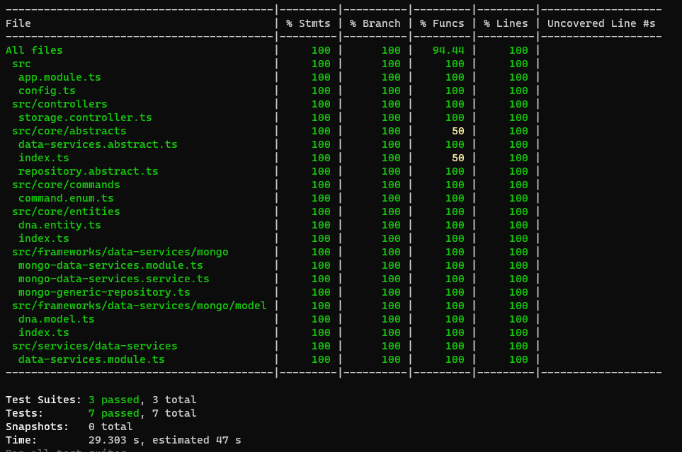
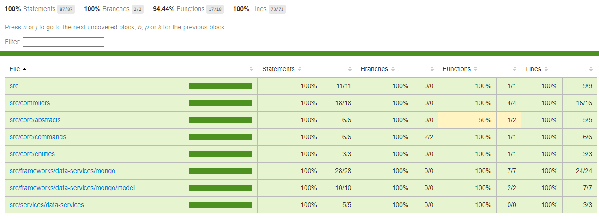

> Aclaración: los siguentes comando y explicaciones se debe estar situalo en la carpeta "stats"

## Instalación

```bash
$ npm install
```

## Correr la aplicación

Antes de correr la aplicación, hay que configurar las variables de entorno para que se comunique al servicio externo de redis

crear el archivo **.env** y crear las siguientes variables

```
REDIS_CONNECTION={connección al redis}
REDIS_PORT={puerto del redis}
REDIS_PASSWORD={contraseña para acceder a recurso en redis}

MONGO_DB={nombre de la base de datos}
MONGO_INITDB_ROOT_USERNAME={usuario}
MONGO_INITDB_ROOT_PASSWORD={contraseña}
MONGO_HOST={host en mongodb}
MONGO_CONNECTION=mongodb+srv
```

Después de configurar las variables correr alguno de los siguentes comandos

```bash
# modo desarrollo
$ npm run start

# modo desarrollo pero con watch para observar cambios
$ npm run start:dev

# modo producción, corriendo directamente el main.js
$ npm run start:prod
```

Al ser un microservicio no queda corriendo en un puerto, y no se puede abrir con el localhost

## Test

```bash
# unit tests
$ npm run test

# test coverage
$ npm run test:cov
```

### Cobertura en consola



### Cobertura en html del reporte


